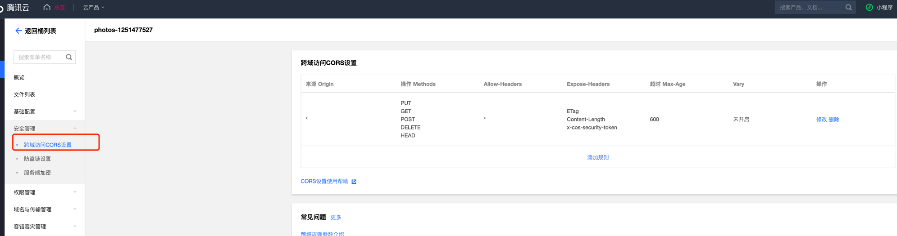

# mpm

## 介绍

My Photo Manager，个人相册管理

## 软件架构

后端使用 springboot
前端使用 flutter
图片存储采用腾讯云 COS，需要自行购买

## 开发

1. 准备好数据库，按/mpm-server/src/main/sql目录下的版本次序执行sql语句
2. 在本地 resources 目录下建立 application.properties 文件，参考 /mpm-server/src/main/resources/application.properties.template
3. 其中的 isDev要设置为true
4. 后端在IDEA里面启动springboot的方式运行后台或者用 mvn 来启动后台服务
5. 前端使用 flutter run 来运行

## 本地部署

1. 准备好数据库，按/mpm-server/src/main/sql目录下的版本次序执行sql语句
2. 在源码的上一级目录下创建 config 目录，并创建 application.properties，参考源码中的 /mpm-server/src/main/resources/application.properties.template
3. 运行 deploy.sh 来进行本地构建和部署
4. 浏览器访问 application.properties 配置的端口

## Docker 部署

1. 准备好数据库，按/mpm-server/src/main/sql目录下的版本次序执行sql语句
2. 创建 config 目录，并创建 application.properties，参考源码中的 /mpm-server/src/main/resources/application.properties.template
3. 使用 docker run  --net=host --name mpm -v /home/simon/config:/config -v /home/simon/logs:/logs -d ghcr.io/simonlei/mpm:xxx 来启动docker镜像
4. 浏览器访问 application.properties 配置的端口

## 腾讯云 COS 配置

1. 将桶设置成 私写公读
2. 将桶的 CORS 设置加上所有源均可访问

3. 在桶的数据处理->图片处理当中，打开高级压缩

## Release:

[RELEASE 情况](RELEASE.md)
