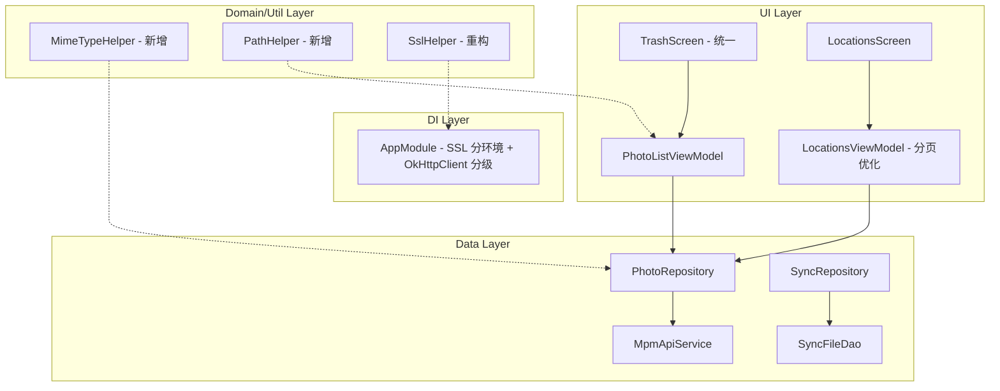

## 用户需求

检查 MPM (My Photo Manager) Android 应用的整体设计，找出可以优化的地方并提供改进方案。

## 产品概述

MPM 是一个 Android 照片管理应用，使用 Kotlin + Jetpack Compose 构建，连接后端 Go 服务器进行照片的浏览、上传、同步、管理等操作。应用采用 MVVM 架构，使用 Hilt 依赖注入、Room 本地数据库、Retrofit 网络请求、DataStore 偏好存储。

## 核心优化项

### 1. 重复代码消除

- 存在两个功能重叠的 TrashScreen 实现（`feature/photos/TrashScreen.kt` 和 `feature/trash/TrashScreen.kt`），以及对应的两个 ViewModel（`TrashViewModel` 和 `PhotoListViewModel`），需要统一为一个。
- MIME 类型检测代码（`getContentType` + `detectMimeTypeFromHeader`）在 `UploadViewModel` 和 `PhotoSyncService` 中完全重复，需要抽取为公共工具类。
- `buildTargetPath` 方法在 `UploadViewModel` 和 `PhotoSyncService` 中重复，需要抽取。

### 2. 严重性能问题

- `LocationsViewModel` 一次加载 1000 张照片到内存并在客户端按 address 分组，对于大量照片会导致内存溢出和卡顿。

### 3. 安全问题

- `AppModule` 中 OkHttpClient 信任所有 SSL 证书和所有主机名，生产环境存在中间人攻击风险。
- `VideoPlayer.kt` 中设置全局 `HttpsURLConnection.setDefaultSSLSocketFactory` 信任所有证书，影响整个应用的 HTTPS 连接安全。
- 上述两处 SSL 配置需要区分 Debug 和 Release 环境。

### 4. 大文件拆分

- `PhotoSyncService`（616行）、`SyncViewModel`（612行）、`SyncRepository`（604行）、`PhotoRepository`（474行）、`PhotoListViewModel`（489行）职责过重，需要合理拆分。

### 5. 错误处理不统一

- 各 ViewModel 错误处理方式混乱，有的用自定义 `Result` wrapper，有的用标准 `kotlin.Result`（如 `SyncRepository`），需要统一。

### 6. 视频缓存配置过大

- `VideoPlayer.kt` 中 LRU 缓存设置为 1GB，对移动设备可能过大。

### 7. 网络请求超时不灵活

- 所有请求共用一个 OkHttpClient（30s 超时），上传大文件场景需要更长超时。

## 技术栈

- 语言：Kotlin
- UI 框架：Jetpack Compose + Material3
- 架构：MVVM + Repository + Hilt DI
- 网络：Retrofit + OkHttp
- 本地存储：Room + DataStore
- 异步：Kotlin Coroutines + Flow
- 视频播放：Media3 ExoPlayer

## 实现方案

### 1. 统一 TrashScreen 并消除重复代码

**策略**：保留 `feature/trash/TrashScreen.kt`（使用通用 `PhotoListViewModel`，功能更完善，支持恢复照片和进度对话框），删除 `feature/photos/TrashScreen.kt` 和 `feature/photos/TrashViewModel.kt`。同时修改 `MpmNavGraph.kt` 中的 import 指向新位置。

**决策依据**：

- `feature/trash/TrashScreen.kt` 已经使用 `PhotoGrid` 通用组件，代码复用更好
- `PhotoListViewModel` 作为通用 ViewModel 已覆盖回收站所有功能（恢复、清空、进度轮询）
- `TrashViewModel` 是独立实现，功能不如 `PhotoListViewModel` 完善（缺少恢复功能和进度追踪）

**修改**：

- 更新 `MpmNavGraph.kt` 的 import 从 `feature.photos.TrashScreen` 改为 `feature.trash.TrashScreen`
- 修复 `feature/trash/TrashScreen.kt` 中硬编码的 serverUrl
- 调整 `onPhotoClick` 参数类型以匹配导航图中的 `(Int) -> Unit` 回调

### 2. 抽取 MIME 类型检测公共工具

**策略**：新建 `util/MimeTypeHelper.kt`，将 `getContentType` 和 `detectMimeTypeFromHeader` 逻辑合并，同时优先使用 Android 系统 API `ContentResolver.getType()` 作为第一选择，文件头检测作为回退，扩展名作为最终兜底。抽取 `buildTargetPath` 到 `util/PathHelper.kt`。

### 3. SSL 安全配置区分环境

**策略**：利用 `BuildConfig.DEBUG` 区分环境。在 `AppModule.provideOkHttpClient` 中，仅在 Debug 模式下使用 TrustAll 证书，Release 模式使用系统默认证书验证。同样处理 `VideoPlayer.kt` 中的全局 SSL 配置。

**注意事项**：

- `build.gradle.kts` 已启用 `buildConfig = true`，可以直接使用 `BuildConfig.DEBUG`
- Release 模式使用默认 SSL 配置，无需特殊处理
- 如果用户使用自签名证书，可以通过添加自定义 TrustStore 支持（后续可扩展）

### 4. LocationsViewModel 性能优化

**策略**：采用分页加载 + 服务端分组方案。由于后端 Go 服务可能不支持按 address 分组的 API，短期方案为：

1. 改为分页加载（而非一次 1000 条），通过多次请求累积构建分组
2. 缓存已加载的分组结果，避免重复请求
3. 限制最大加载量，设置合理上限（如 5000 条，分批加载）

**关键修改**：

- 修改 `loadLocations()` 使用分批加载策略，每次加载一页数据并合并到分组结果中
- 添加加载进度反馈

### 5. 网络请求超时分级

**策略**：在 `AppModule` 中提供两个 OkHttpClient 实例：

- 默认 client：30s 超时，用于普通 API 请求
- 上传 client（通过 `@Named("upload")` 限定）：120s 读写超时，用于文件上传

**实现**：使用 Hilt 的 `@Named` 注解区分，`PhotoRepository` 的 `uploadPhoto` 方法使用上传专用 client。

### 6. 视频缓存大小优化

**策略**：将 `VideoCacheManager` 中的缓存大小从 1GB 降至 256MB，这对移动设备更合理，同时仍能缓存多个视频片段。

### 7. 统一错误处理

**策略**：`SyncRepository` 中使用了 `kotlin.Result`，而网络层使用自定义 `com.simon.mpm.common.Result`。两者混用容易混淆。统一 SyncRepository 内部使用标准 kotlin.Result（因为它不涉及 Loading 状态），但确保与调用方的交互清晰。主要修复 import 混淆问题，添加类型别名避免歧义。

## 实现注意事项

### 性能

- LocationsViewModel 分批加载时需要注意 Flow collect 的协程管理，避免重复 collect
- 视频缓存大小调整后，缓存命中率会下降，但 256MB 对大多数使用场景足够
- 上传专用 OkHttpClient 不需要日志拦截器的 BODY 级别，保持 HEADERS 级别避免大文件日志

### 向后兼容

- 删除 `TrashScreen` 和 `TrashViewModel` 后需确保没有其他文件引用它们
- SSL 配置变更仅影响 Release 构建，Debug 行为不变
- OkHttpClient 拆分需要确保 Coil ImageLoader 和 Retrofit 都使用正确的 client 实例

### 日志

- 保持现有的 `Log.d/e/w` 日志模式，不引入新的日志框架
- MIME 检测工具类沿用 `Log.d` 输出检测结果

## 架构设计

当前项目遵循标准 MVVM 分层架构，本次优化不改变整体架构，仅在以下层面进行改进：



## 目录结构

```
apps/app/src/main/java/com/simon/mpm/
├── util/
│   ├── MimeTypeHelper.kt          # [NEW] 统一的 MIME 类型检测工具。整合文件头检测、ContentResolver.getType()、扩展名推断三种策略。供 UploadViewModel 和 PhotoSyncService 共用，替代两处重复的 getContentType/detectMimeTypeFromHeader 实现。
│   └── PathHelper.kt              # [NEW] 文件路径构建工具。提供 buildTargetPath(account, lastModified, fileName) 方法，统一 UploadViewModel 和 PhotoSyncService 中重复的路径构建逻辑。
├── di/
│   └── AppModule.kt               # [MODIFY] 1) SSL 配置区分 Debug/Release 环境，Release 使用系统默认证书验证；2) 新增 @Named("upload") OkHttpClient 提供 120s 读写超时的上传专用客户端；3) 默认 OkHttpClient 保持 30s 超时。
├── feature/
│   ├── photos/
│   │   ├── TrashScreen.kt         # [DELETE] 删除冗余的回收站实现，统一使用 feature/trash/TrashScreen.kt。
│   │   ├── TrashViewModel.kt      # [DELETE] 删除冗余的回收站 ViewModel，统一使用 PhotoListViewModel。
│   │   ├── VideoPlayer.kt         # [MODIFY] 1) SSL 配置区分 Debug/Release 环境；2) 视频缓存大小从 1GB 降至 256MB；3) 避免设置全局 HttpsURLConnection 默认 SSL 配置。
│   │   └── PhotoListViewModel.kt  # [MODIFY] 去除内嵌的回收站硬编码 serverUrl（已在 PhotoRepository 中处理），确保作为唯一的回收站 ViewModel 功能完备。
│   ├── trash/
│   │   └── TrashScreen.kt         # [MODIFY] 1) 删除硬编码 serverUrl；2) 调整 onPhotoClick 参数类型为 (Int) -> Unit 以匹配导航回调；3) 作为唯一的回收站屏幕。
│   ├── locations/
│   │   └── LocationsViewModel.kt  # [MODIFY] 重构 loadLocations() 从一次加载 1000 条改为分批加载（每批 200 条），逐步累积构建地址分组，支持加载进度显示，设置最大加载上限 5000 条。
│   └── upload/
│       └── UploadViewModel.kt     # [MODIFY] 删除重复的 getContentType/detectMimeTypeFromHeader/buildTargetPath 方法，改为调用 MimeTypeHelper 和 PathHelper 工具类。
├── service/
│   └── PhotoSyncService.kt        # [MODIFY] 删除重复的 getContentType/detectMimeTypeFromHeader/buildTargetPath 方法，改为调用 MimeTypeHelper 和 PathHelper 工具类。
├── navigation/
│   └── MpmNavGraph.kt             # [MODIFY] 更新 TrashScreen 的 import 路径从 feature.photos.TrashScreen 改为 feature.trash.TrashScreen，调整 onPhotoClick 回调适配。
└── data/
    └── repository/
        └── PhotoRepository.kt     # [MODIFY] uploadPhoto 方法改为使用 @Named("upload") OkHttpClient 进行文件上传（通过注入上传专用的 Retrofit 或直接使用 OkHttpClient 发请求）。
```

## 关键代码结构

```
// util/MimeTypeHelper.kt - 统一 MIME 类型检测接口
object MimeTypeHelper {
    /**
     * 获取文件的 Content-Type，优先级：
     * 1. ContentResolver.getType()
     * 2. 文件头字节检测
     * 3. 文件扩展名推断
     */
    fun getContentType(context: Context, uri: Uri, fileName: String): String
    
    // 内部方法：文件头检测
    internal fun detectMimeTypeFromHeader(header: ByteArray, size: Int): String?
}

// util/PathHelper.kt - 路径构建工具
object PathHelper {
    /** 构建上传目标路径：account/yyyy/MM/fileName */
    fun buildTargetPath(account: String, lastModified: Long, fileName: String): String
}
```

## Agent Extensions

### SubAgent

- **code-explorer**
- 用途：在删除 TrashScreen 和 TrashViewModel 之前，全面搜索项目中对这两个类的所有引用，确保不遗漏任何依赖点
- 预期结果：获得所有引用了 `feature.photos.TrashScreen`、`feature.photos.TrashViewModel`、`TrashUiState` 的文件列表，确保清理完整